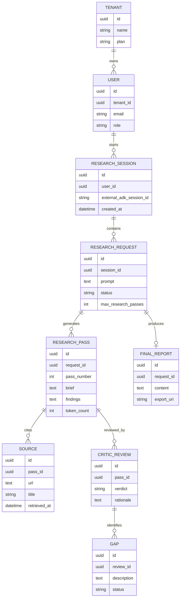

### 1. EXECUTIVE SUMMARY

**Project Name & Core Concept**  
**agent-as-tool** is a TypeScript Google ADK research-agent prototype that turns a user’s research request into an iterative multi-agent workflow. The system has three agent roles: a `researcher` that searches the web, a `critic` that evaluates coverage, and a `research_root` orchestrator that repeats research until the critic approves the result. Evidence: [agent.ts](/Volumes/MAC_DOCS/repos/GDG-02/gdg-warsaw/agent-as-tool/agent.ts:12), [agent.ts](/Volumes/MAC_DOCS/repos/GDG-02/gdg-warsaw/agent-as-tool/agent.ts:49).

**Target Audience & Market Fit**  
Primary users are analysts, consultants, product teams, compliance teams, and technical researchers who need sourced, gap-checked research outputs. The market fit is strongest as an internal enterprise research assistant or a developer-facing reference implementation for critic-driven agent orchestration. Current code is a functional prototype, not yet a production SaaS platform.

**Source Material Status**  
Processed all repository files outside `node_modules`: `pnpm-workspace.yaml`, `package.json`, `agent.ts`, `pnpm-lock.yaml`, and `chat.sh`. No Python files were present.

**Assumptions**  
The intended deployment target is Google Cloud Run because `chat.sh` calls a Cloud Run URL and obtains Google identity tokens through `gcloud auth print-identity-token`. The project does not currently define persistent storage, tenant management, billing, a browser UI, CI/CD, tests, or observability configuration, so these are recommended additions rather than existing capabilities.

### 2. BUSINESS & FUNCTIONAL ARCHITECTURE

**Core Value Proposition**  
The project reduces manual research time by enforcing an agentic quality loop: initial web research, structured source-backed findings, independent critique, targeted follow-up research, and final synthesis. Its differentiator is not generic chat, but repeatable research completeness control.

| Module | Existing / Recommended | Description | Evidence / Notes |
|---|---:|---|---|
| Research Orchestration | Existing | Root agent delegates to researcher and critic until approval. | [agent.ts](/Volumes/MAC_DOCS/repos/GDG-02/gdg-warsaw/agent-as-tool/agent.ts:56) |
| Web Research | Existing | Researcher uses Google Search and URL context tools. | [agent.ts](/Volumes/MAC_DOCS/repos/GDG-02/gdg-warsaw/agent-as-tool/agent.ts:27) |
| Quality Review | Existing | Critic checks missing facts, weak sourcing, vague/outdated claims. | [agent.ts](/Volumes/MAC_DOCS/repos/GDG-02/gdg-warsaw/agent-as-tool/agent.ts:37) |
| CLI / Remote Chat | Existing | Bash REPL sends messages to deployed ADK `/run` endpoint. | [chat.sh](/Volumes/MAC_DOCS/repos/GDG-02/gdg-warsaw/agent-as-tool/chat.sh:47) |
| Authentication | Partial | Uses Google identity token for Cloud Run access; no end-user auth model. | [chat.sh](/Volumes/MAC_DOCS/repos/GDG-02/gdg-warsaw/agent-as-tool/chat.sh:16), [Cloud Run auth docs](https://docs.cloud.google.com/run/docs/authenticating/overview) |
| Session Management | Partial | Script creates timestamp-based sessions; no durable session schema visible. | [chat.sh](/Volumes/MAC_DOCS/repos/GDG-02/gdg-warsaw/agent-as-tool/chat.sh:40) |
| Admin / Evaluation | Recommended | Add prompt/version evaluation, regression sets, source-quality scoring. | Not present |
| Persistence / Audit | Recommended | Store requests, passes, critic gaps, sources, final reports, token/cost metrics. | Not present |
| Observability | Recommended | ADK dependencies include OpenTelemetry packages; configure traces/logs explicitly. | `pnpm-lock.yaml` ADK dependency graph |
| Frontend | Recommended | Add web workspace for research submission, review, export, and history. | `package.json` only exposes ADK run/web scripts |

**Key User Workflows**

1. Analyst submits research request.
2. Root agent converts request into a researcher brief.
3. Researcher returns 4-8 sourced bullets using web search and URL context.
4. Critic evaluates coverage against the original request.
5. If gaps exist, root agent sends a narrow follow-up brief focused only on missing items.
6. Once approved, root agent writes the final integrated report with citations.
7. For deployed usage, `chat.sh` creates a session, sends the request to `/run`, and streams readable function-call/output events.

### 3. TECHNICAL ARCHITECTURE SPECIFICATION

**Recommended Tech Stack & Justification**

| Layer | Recommendation | Justification |
|---|---|---|
| Agent Runtime | Google ADK TypeScript, current package line already used | Keeps the existing code-first agent architecture. ADK is positioned as an open-source framework for reliable agents at enterprise scale: [ADK docs](https://adk.dev/). |
| Model Provider | Gemini via `@google/genai` / ADK model config | Existing agents use `gemini-3-flash-preview`; centralize model IDs in config. |
| Backend API | ADK service on Cloud Run plus thin NestJS/Fastify gateway if multi-tenant SaaS is needed | Cloud Run matches current deployment client and scales well for stateless request workloads. |
| Auth | Google IAM for internal use; Identity Platform or OAuth2/OIDC with HttpOnly session cookies for external users | Current script uses identity tokens; Cloud Run supports authenticated services via IAM. |
| Database | PostgreSQL with Prisma or MikroORM | Lockfile already resolves MikroORM adapters through ADK; PostgreSQL fits audit trails, reports, tenants, and usage metrics. |
| Cache / Queue | Redis or Cloud Tasks | Use for async long-running research, retry control, rate limiting, and job state. |
| Object Storage | Google Cloud Storage | ADK dependency graph already includes `@google-cloud/storage`; use for exported reports and raw evidence snapshots. |
| Observability | OpenTelemetry to Google Cloud Trace/Logging/Monitoring | ADK lockfile includes OpenTelemetry and Google Cloud exporters. |
| Frontend | Next.js or Angular dashboard | Research history, source review, approval states, export, and admin controls. |
| Package Tooling | pnpm, ESM TypeScript | Existing scripts use `pnpm exec adk run/web` and `"type": "module"` in [package.json](/Volumes/MAC_DOCS/repos/GDG-02/gdg-warsaw/agent-as-tool/package.json:6). |

**Conceptual Entity-Relationship Diagram**

**Integration Points & External Dependencies**

| Integration | Current Status | Required Controls |
|---|---|---|
| Google Search / URL Context | Used directly by researcher tools | Source allow/deny lists, citation normalization, source freshness checks. |
| Gemini / Google GenAI | Used through ADK model config and resolved dependencies | Model routing, cost limits, retry policy, prompt/version audit. |
| Cloud Run ADK API | Used by `chat.sh` via `$URL/run` | IAM, service account least privilege, request timeout policy. |
| gcloud Identity Token | Used by `chat.sh` | For internal CLI only; replace with end-user auth for public app. |
| jq / curl | Required local CLI tools | Document setup and add preflight validation. |
| pnpm build permissions | Allows builds for `@google/genai`, `esbuild`, `protobufjs`, `sqlite3` | Pin Node version >=20 due to GenAI and Azure transitive engine constraints. |

### 4. IMPLEMENTATION ROADMAP & RISK MATRIX

**Milestone Breakdown**

| Phase | Scope | Deliverables |
|---|---|---|
| MVP Hardening | Stabilize current prototype | Move model/deployment values to env config, add max research pass limit, add tests for orchestration prompts, document local/deployed usage. |
| Production Internal Tool | Make it usable by teams | Cloud Run deployment pipeline, Google IAM access, PostgreSQL audit store, source and report persistence, structured logs/traces, usage dashboard. |
| SaaS / Multi-Tenant | Add commercial product surface | OAuth2/OIDC auth, tenant model, roles, billing integration, rate limits, export formats, saved research workspaces. |
| Scale & Governance | Enterprise readiness | Evaluation harness, prompt versioning, source policy controls, PII redaction, retention policy, incident monitoring, cost anomaly alerts. |

| Risk Description | Impact Level | Mitigation Strategy |
|---|---:|---|
| Infinite or excessive critic-research loop; comment suggests a 3-call limit but code does not enforce it. | High | Add `maxResearchPasses=3`, persist pass count, stop with partial report plus unresolved gaps. |
| Preview model dependency may change behavior or availability. | High | Externalize model config, define fallback model, run regression evals before upgrades. |
| Web sources may be stale, low-quality, or unavailable. | High | Enforce source metadata, freshness checks, domain policy, and critic rules for unsupported claims. |
| Current auth is suitable for developer/internal Cloud Run access, not public users. | High | Use Identity Platform/OIDC, HttpOnly cookies, CSRF protection, tenant-scoped authorization. |
| No durable audit trail for generated claims. | Medium | Store prompts, passes, critic reviews, source URLs, timestamps, and final outputs in PostgreSQL. |
| No automated tests or CI visible. | Medium | Add unit tests for prompt contracts, mocked ADK tool calls, shell script smoke checks, and CI on pull requests. |
| Cost spikes from repeated searches and LLM calls. | Medium | Add per-user quotas, pass limits, request budgeting, cache repeated URL fetches, and cost telemetry. |
| CLI script has hardcoded default deployment URL and user ID. | Medium | Require explicit `.env` or config file for production; fail fast when defaults are used outside development. |
| Observability dependencies exist but no configuration is visible. | Medium | Configure OpenTelemetry exporters, trace each research pass, and attach request/session IDs to logs. |
| Business model is implicit. | Medium | Decide whether product is internal productivity tool, paid research SaaS, or developer framework sample before expanding architecture. |

**Conclusion**  
The current repository is a compact but coherent ADK research-agent prototype. Its strongest architectural idea is the critic-driven refinement loop. The next engineering priority is to turn that loop into a bounded, observable, persistent workflow with explicit authentication, source governance, and evaluation.