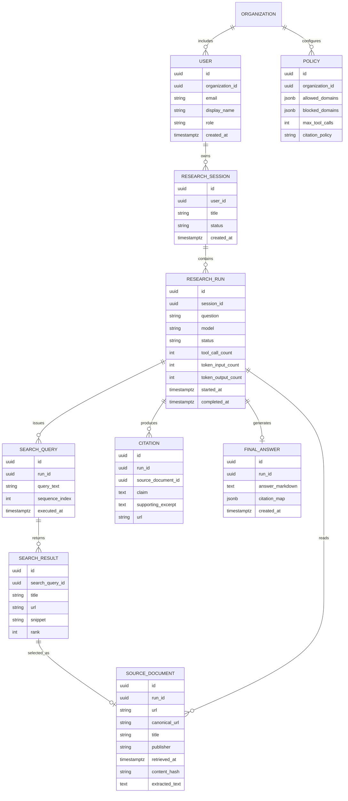

## 1. EXECUTIVE SUMMARY

**Project Name & Core Concept**

Project name: `coordinator`  
Current implementation: a Google ADK-based research assistant defined in [agent.ts](/Volumes/MAC_DOCS/repos/GDG-02/gdg-warsaw/coordinator/agent.ts:5). The agent searches the web, reads selected pages, and returns concise answers with citations. It is runnable either as a CLI-style ADK agent or through ADK web tooling via scripts in [package.json](/Volumes/MAC_DOCS/repos/GDG-02/gdg-warsaw/coordinator/package.json:6).

**Target Audience & Market Fit**

The project targets users who need verifiable research answers rather than generic LLM responses: analysts, founders, product teams, researchers, journalists, technical strategists, and enterprise knowledge workers. Its strongest market fit is “answer synthesis with source grounding,” especially for workflows where hallucination risk is unacceptable.

**Source-Based Findings**

The repository currently contains:

- TypeScript agent program: [agent.ts](/Volumes/MAC_DOCS/repos/GDG-02/gdg-warsaw/coordinator/agent.ts:1)
- pnpm package metadata: [package.json](/Volumes/MAC_DOCS/repos/GDG-02/gdg-warsaw/coordinator/package.json:1)
- pnpm build allowlist: [pnpm-workspace.yaml](/Volumes/MAC_DOCS/repos/GDG-02/gdg-warsaw/coordinator/pnpm-workspace.yaml:1)
- Lockfile evidence for Google ADK and supporting dependencies
- No Python files outside `node_modules`

**Assumptions**

| Area | Assumption |
|---|---|
| Business model | The project is an early prototype intended to become a reusable research assistant or internal research service. |
| Users | Initial users are internal operators or developers using ADK CLI/web, not public SaaS customers. |
| Persistence | No database is currently implemented; durable storage is a future requirement. |
| Authentication | No auth exists today; enterprise deployment requires OAuth2/OIDC. |
| Revenue | Likely monetization paths are subscription, internal productivity ROI, usage-based research credits, or embedded enterprise licensing. |

---

## 2. BUSINESS & FUNCTIONAL ARCHITECTURE

**Core Value Proposition**

The system solves the problem of ungrounded LLM answers by forcing a search-first workflow. The agent instruction explicitly requires it to search before answering, prefer primary sources, read selected pages through URL context, and stop tool usage once evidence is sufficient [agent.ts](/Volumes/MAC_DOCS/repos/GDG-02/gdg-warsaw/coordinator/agent.ts:11).

The value is produced through:

- Faster research triage
- Reduced hallucination risk
- Citation-backed answers
- Primary-source preference
- Repeatable research workflow
- Potential integration into enterprise knowledge systems

**Functional Modules & Feature Matrix**

| Module | Current Status | Current Evidence | Target Capability |
|---|---:|---|---|
| Agent Runtime | Implemented | `LlmAgent` exported as `rootAgent` | Multi-agent orchestration, session memory, task routing |
| LLM Reasoning | Implemented | `gemini-3-flash-preview` configured | Model selection by task complexity, fallback model policy |
| Web Search | Implemented | `GOOGLE_SEARCH` tool | Query planning, source ranking, duplicate filtering |
| URL Reading | Implemented | `URL_CONTEXT` tool | Full-page extraction, metadata capture, content freshness checks |
| Citation Synthesis | Prompted | Instruction requires citations | Structured citations with URL, title, date, excerpt hash |
| Source Quality Policy | Prompted | “Prefer primary sources over aggregators” | Domain trust scoring, blocked domains, source-type classification |
| Tool Governance | Prompted | “Stop calling tools as soon as answer is solid” | Tool budget, max search depth, audit logs |
| Web Interface | Available via ADK | `pnpm exec adk web agent.ts` | Authenticated web app with saved research sessions |
| CLI Execution | Available via ADK | `pnpm exec adk run agent.ts` | Batch mode, JSON output, CI/API integration |
| Validation Layer | Dependency present, unused | `zod` dependency | Schemas for requests, responses, citations, source records |
| Logging/Telemetry | Not active | `setLogger` imported/commented | OpenTelemetry traces, prompt/tool logs, cost tracking |
| Storage | Not implemented | No DB code | PostgreSQL for users/sessions; object storage for extracted pages |
| Auth/RBAC | Not implemented | No auth code | OAuth2/OIDC with HttpOnly secure cookies and role-based policies |
| API Layer | Not implemented | No server code | REST or tRPC/Fastify API around agent execution |
| Notifications | Not implemented | No provider code | Email/Slack/webhook delivery for completed research |

**Key User Workflows**

1. **Single Research Query**
   - User submits a question.
   - Agent generates a focused search query.
   - Agent calls Google Search.
   - Agent selects the most relevant URL.
   - Agent reads the page with URL Context.
   - Agent decides whether another source is needed.
   - Agent returns a concise answer with citations.

2. **Source-Grounded Business Research**
   - User asks for market, competitor, policy, or technical research.
   - Agent prioritizes primary sources.
   - Agent avoids answering from memory.
   - Agent synthesizes only after gathering enough evidence.
   - Output includes cited support for claims.

3. **Future Enterprise Research Workflow**
   - User authenticates through company SSO.
   - User creates a research task with required source types.
   - Agent performs multi-step research.
   - System stores sources, extracted content metadata, and final answer.
   - User exports the result to Markdown, PDF, CRM, Slack, or knowledge base.

---

## 3. TECHNICAL ARCHITECTURE SPECIFICATION

**Current Technology Stack**

| Layer | Current Choice | Evidence |
|---|---|---|
| Runtime | Node.js / TypeScript ESM | `"type": "module"` in [package.json](/Volumes/MAC_DOCS/repos/GDG-02/gdg-warsaw/coordinator/package.json:13) |
| Agent Framework | `@google/adk` | Dependency in [package.json](/Volumes/MAC_DOCS/repos/GDG-02/gdg-warsaw/coordinator/package.json:15) |
| Model | `gemini-3-flash-preview` | [agent.ts](/Volumes/MAC_DOCS/repos/GDG-02/gdg-warsaw/coordinator/agent.ts:7) |
| Tools | Google Search, URL Context | [agent.ts](/Volumes/MAC_DOCS/repos/GDG-02/gdg-warsaw/coordinator/agent.ts:22) |
| Validation | `zod`, currently unused | [package.json](/Volumes/MAC_DOCS/repos/GDG-02/gdg-warsaw/coordinator/package.json:16) |
| Dev UI | `@google/adk-devtools` | [package.json](/Volumes/MAC_DOCS/repos/GDG-02/gdg-warsaw/coordinator/package.json:19) |
| Package Manager | pnpm | `pnpm-lock.yaml`, `pnpm-workspace.yaml` |
| Native Build Allowlist | Google GenAI, esbuild, protobufjs, sqlite3 | [pnpm-workspace.yaml](/Volumes/MAC_DOCS/repos/GDG-02/gdg-warsaw/coordinator/pnpm-workspace.yaml:1) |

**Recommended Production Stack & Justification**

| Layer | Recommendation | Justification |
|---|---|---|
| Backend | Node.js 22 LTS, TypeScript, Fastify or NestJS | Matches current TypeScript/ADK implementation; gives typed API boundary |
| Agent Runtime | Google ADK | Already implemented; preserves existing tool orchestration |
| Frontend | Next.js or Angular | Authenticated research console, saved sessions, source viewer |
| Database | PostgreSQL | Durable users, research runs, citations, source metadata |
| ORM | Prisma or Drizzle | Typed schema migrations and query safety |
| Cache/Queue | Redis + BullMQ | Async research jobs, retries, rate limiting, tool-budget control |
| Object Storage | S3-compatible storage | Store extracted pages, rendered reports, exported artifacts |
| Auth | OAuth2/OIDC with PKCE, HttpOnly Secure SameSite cookies | Enterprise SSO-compatible, browser-safe session handling |
| Secrets | Google Secret Manager / AWS Secrets Manager | Protect API keys and model credentials |
| Observability | OpenTelemetry + structured JSON logs | Trace LLM calls, tool calls, latency, cost, and failures |
| Deployment | Cloud Run, AWS ECS/Fargate, or Kubernetes | Fits stateless API workers plus separate job workers |
| CI/CD | GitHub Actions with pnpm install, typecheck, lint, test | Reproducible delivery path |

**Conceptual Entity-Relationship Diagram**

**Integration Points & External Dependencies**

| Integration | Current/Future | Purpose | Control Mechanism |
|---|---:|---|---|
| Google ADK | Current | Agent runtime and tool execution | Version pinning, integration tests |
| Gemini model endpoint | Current | LLM reasoning | Model registry, fallback configuration |
| Google Search tool | Current | Evidence discovery | Query budget, source ranking policy |
| URL Context tool | Current | Full-page reading | URL allow/deny lists, content size limits |
| ADK Web | Current | Local web UI | Development-only unless protected by auth |
| OAuth2/OIDC provider | Future | SSO login | PKCE, signed session cookies, RBAC |
| PostgreSQL | Future | Durable application state | Migrations, row-level organization scoping |
| Redis/BullMQ | Future | Async jobs and rate limits | Per-user and per-org quotas |
| Slack/Email/Webhooks | Future | Notifications and delivery | Signed webhook payloads, retry policy |
| Observability backend | Future | Logs, traces, metrics | OpenTelemetry spans around model/tool calls |

---

## 4. IMPLEMENTATION ROADMAP & RISK MATRIX

**Milestone Breakdown**

| Phase | Scope | Deliverables |
|---|---|---|
| MVP Stabilization | Harden the existing ADK agent | Pin model policy, add Zod request/response schemas, define citation output shape, add tests for instruction contract |
| MVP Product Shell | Make the agent usable by non-developers | Authenticated web UI, research input form, answer viewer, citation list, source preview |
| Persistence Phase | Store work and enable auditability | PostgreSQL schema, saved sessions, source documents, final answers, query history |
| Operational Phase | Production readiness | Structured logging, OpenTelemetry traces, error taxonomy, retry policy, rate limits, cost tracking |
| Enterprise Phase | Team and governance features | Organizations, RBAC, domain policies, source quality scoring, export controls |
| Scale Phase | High-volume research platform | Queue workers, parallel source evaluation, cache, batch jobs, webhook/API access |

**Concrete Near-Term Implementation Tasks**

| Priority | Task |
|---:|---|
| P0 | Add `tsconfig.json`, `lint`, `typecheck`, and test scripts. |
| P0 | Use `zod` to define `ResearchRequest`, `Citation`, and `ResearchAnswer` schemas. |
| P0 | Remove unused `setLogger` import or enable structured logging. |
| P1 | Add environment validation for Google credentials and model configuration. |
| P1 | Wrap `rootAgent` with an API handler for programmatic invocation. |
| P1 | Add tests asserting the agent instruction requires search-first behavior, citation output, and primary-source preference. |
| P2 | Add persistent research sessions and source records. |
| P2 | Add source policy controls: allowed domains, blocked domains, max tool calls, max URLs read. |
| P3 | Add organization accounts, SSO, billing/usage metering, and admin dashboards. |

**Risk/Mitigation Table**

| Risk Description | Impact Level | Mitigation Strategy |
|---|---:|---|
| Agent may still produce unsupported claims despite prompt instructions | High | Require structured output with claim-to-citation mapping; reject final answers missing citations; add evaluator tests. |
| Search result quality varies by query phrasing | High | Add query planning, query rewriting, and minimum-source thresholds for high-risk topics. |
| Primary-source preference is only prompt-enforced | Medium | Implement source classifier: official domains, government, academic, vendor docs, news, aggregator. |
| No authentication or authorization exists | High | Add OAuth2/OIDC login with PKCE, HttpOnly Secure SameSite cookies, CSRF protection, and RBAC. |
| No persistent audit trail | High | Store every research run, search query, selected URL, source hash, citation, and final answer in PostgreSQL. |
| Tool usage can become costly or slow | Medium | Enforce per-run max tool calls, timeout budgets, Redis-backed rate limits, and cost metrics. |
| External tool/API changes may break behavior | Medium | Pin dependency versions, add smoke tests for ADK tool availability, monitor model/tool errors. |
| `gemini-3-flash-preview` may be unstable for production due to preview status | Medium | Define model registry with production fallback and environment-based model selection. |
| Legal/copyright risk from storing full page text | Medium | Store metadata and short excerpts by default; store full text only when licensed or internally approved. |
| Lack of frontend limits adoption | Medium | Build a small authenticated research console before expanding agent capabilities. |
| No Python files were found despite prompt mentioning Python | Low | Treat Python as out of scope for current repository; introduce Python only if future data processing requires it. |
| Build dependency surface includes native modules such as `sqlite3` | Low | Keep pnpm build allowlist reviewed; avoid unused native dependencies in production container images. |

**Conclusion**

`coordinator` is currently a focused, minimal Google ADK research-agent prototype. Its strongest architectural idea is already present: force the model to search, read sources, and cite evidence before answering. The next strategic step is not to add many new agent behaviors, but to productize the reliability boundary around the agent: typed schemas, citation validation, persistence, authentication, observability, and source governance.