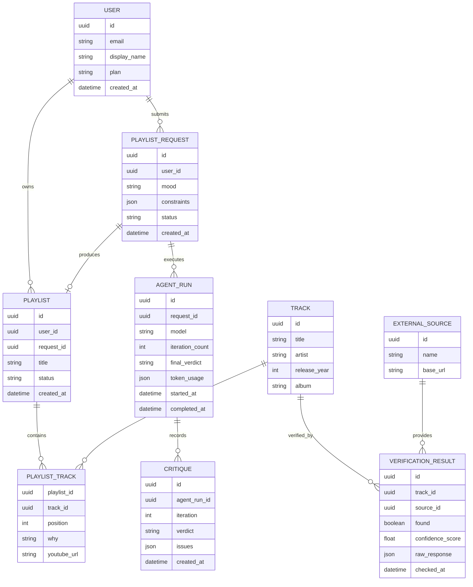

## 1. EXECUTIVE SUMMARY

### Project Name & Core Concept

**Project Name:** Loop Agent / Playlist Curator Agent  
**Source Basis:** [agent.ts](/Volumes/MAC_DOCS/repos/GDG-02/gdg-warsaw/loop-agent/agent.ts), [package.json](/Volumes/MAC_DOCS/repos/GDG-02/gdg-warsaw/loop-agent/package.json), [tsconfig.json](/Volumes/MAC_DOCS/repos/GDG-02/gdg-warsaw/loop-agent/tsconfig.json), [pnpm-workspace.yaml](/Volumes/MAC_DOCS/repos/GDG-02/gdg-warsaw/loop-agent/pnpm-workspace.yaml), [pnpm-lock.yaml](/Volumes/MAC_DOCS/repos/GDG-02/gdg-warsaw/loop-agent/pnpm-lock.yaml)

The project is a **Google ADK-based multi-agent playlist generation system**. A user provides a mood or vibe; the system generates a 10-song playlist, critiques it against explicit quality rules, verifies song existence through MusicBrainz, and iteratively refines the playlist through a bounded loop.

The current implementation is an agent prototype, not a full product platform. It contains no frontend, database, authentication, payments, account model, deployment configuration, or test suite.

### Target Audience & Market Fit

Primary target users are music listeners, playlist creators, content teams, small businesses, DJs, wellness studios, cafes, event planners, and creators who need curated mood-based playlists quickly.

The market fit is strongest where playlist quality matters but manual curation is expensive: creator workflows, branded environments, events, social media content, hospitality, fitness, and mood-driven discovery.

### Assumptions

| Area | Assumption |
|---|---|
| Runtime | Node.js 20+ is required because transitive `@google/genai` and Azure packages require Node >=20. |
| LLM Provider | Gemini is the intended LLM provider via Google ADK using `gemini-flash-latest`. |
| Verification Source | MusicBrainz is the implemented verification source. The source description saying “Spotify verification” is treated as a documentation conflict. |
| Product Direction | The intended product is a playlist-curation assistant that could become either a SaaS tool, API product, or embedded agent workflow. |
| Persistence | Current ADK state is ephemeral unless ADK runtime storage is configured externally. Production needs explicit persistence. |
| Monetization | No revenue logic exists; recommended options are subscription, usage-based API billing, or B2B workflow licensing. |

---

## 2. BUSINESS & FUNCTIONAL ARCHITECTURE

### Core Value Proposition

The system solves the problem of producing **consistent, constraint-aware, mood-matched playlists** without relying solely on one-shot LLM output. Its value comes from a review loop: generate, critique, verify, refine.

For end users, this reduces hallucinated tracks, duplicate artists, duplicate years, and low-quality vibe matching. For businesses, it creates a repeatable workflow for branded music curation.

### Functional Modules & Feature Matrix

| Module | Current Status | Current Behavior | Production Requirement |
|---|---:|---|---|
| Mood Intake | Partial | User provides free-form mood/vibe to root agent | Add structured request schema: mood, genres, eras, exclusions, market, explicit-content flag |
| Playlist Generation | Implemented | `GeneratorAgent` creates exactly 10 songs with title, artist, year, reason, YouTube search URL | Add configurable playlist length, locale, platform target, diversity controls |
| Schema Validation | Implemented | Zod output schemas validate playlist and critique structures | Add API-level request/response validation and typed error responses |
| Critique | Implemented | `CriticAgent` checks count, artist repetition, year uniqueness, mood fit, required fields | Add deterministic validation for count, duplicates, URL format, year format before LLM critique |
| Song Verification | Implemented | `verify_song` calls MusicBrainz recording search with score threshold >=80 | Add retries, timeout, rate limiting, caching, source confidence scoring |
| Refinement Loop | Implemented | `LoopAgent` runs critic/refiner up to 3 iterations | Add loop telemetry, failure reasons, fallback behavior when unable to pass |
| Loop Exit | Implemented | Refiner calls `EXIT_LOOP` on PASS | Add final response formatter and user-facing quality report |
| YouTube Link Generation | Implemented | Agent constructs YouTube search URLs | Replace with deterministic URL builder outside LLM |
| Observability | Disabled/Partial | `setLogger(null)` disables ADK logging | Enable structured logs, OpenTelemetry traces, LLM/token metrics |
| UI | Missing | None | Web app or chat UI for prompt input, playlist output, edits, export |
| Auth & Accounts | Missing | None | OAuth2/OIDC login, JWT session in HttpOnly SameSite cookies |
| Persistence | Missing | None | Store users, requests, generated playlists, critiques, verification results |
| Billing | Missing | None | Stripe subscriptions or usage-based billing if commercialized |
| Admin/Operations | Missing | None | Moderation, rate controls, provider health, audit logs |
| Testing | Missing | No test runner or TypeScript compiler dependency | Add unit tests, integration tests with mocked MusicBrainz, schema contract tests |

### Key User Workflows

**Workflow 1: Basic Playlist Generation**

1. User enters mood: “late-night focus with soft electronic energy.”
2. Generator produces 10 songs.
3. Critic validates hard constraints and calls MusicBrainz for each song.
4. Refiner fixes failures.
5. Loop stops when critique is `PASS` or max 3 iterations is reached.
6. Final playlist is returned with title, artist, year, reason, and YouTube search URL.

**Workflow 2: Failed Verification Recovery**

1. Generated song cannot be verified or receives MusicBrainz score below 80.
2. Critic marks issue as `FAIL`.
3. Refiner replaces the song with a better-known real track.
4. Critic re-verifies the replacement in the next loop.

**Workflow 3: Production User Journey**

1. User signs in.
2. User submits playlist brief with mood, constraints, platform, and exclusions.
3. System creates a generation job.
4. Agent workflow runs asynchronously.
5. User receives playlist, critique summary, and confidence indicators.
6. User edits, exports, saves, or regenerates.

---

## 3. TECHNICAL ARCHITECTURE SPECIFICATION

### Current Technology Stack

| Layer | Current Technology |
|---|---|
| Language | TypeScript, ES2022 modules |
| Package Manager | pnpm |
| Agent Framework | `@google/adk` 1.1.0 |
| Dev Tools | `@google/adk-devtools` 1.1.0 |
| LLM Model | `gemini-flash-latest` |
| Validation | Zod 4.4.3 |
| External API | MusicBrainz Recording API |
| Runtime Entry | `pnpm exec adk run agent.ts` |
| Web Dev Entry | `pnpm exec adk web agent.ts` |

Type checking could not be verified because `tsc` is not installed in the project: `pnpm exec tsc --noEmit` fails with `Command "tsc" not found`.

### Recommended Production Tech Stack & Justification

| Layer | Recommendation | Justification |
|---|---|---|
| Backend Runtime | Node.js 22 LTS with TypeScript | Aligns with Google GenAI Node >=20 requirement and current TS implementation |
| Agent Orchestration | Google ADK | Already used; supports `LlmAgent`, `SequentialAgent`, `LoopAgent`, tools, state |
| API Framework | Fastify or Hono | Lightweight, typed, good fit for agent API boundary |
| Frontend | Next.js or React + Vite | Enables chat-style UX, playlist management, export flows |
| Database | PostgreSQL | Durable storage for users, playlists, requests, critiques, verification records |
| ORM | Prisma or Drizzle | Type-safe migrations and query layer |
| Cache | Redis | Cache MusicBrainz lookups, rate-limit users, store transient job state |
| Jobs | BullMQ or Cloud Tasks | Run playlist generation asynchronously with retries |
| Auth | OAuth2/OIDC with HttpOnly SameSite cookies | Secure browser sessions without exposing tokens to JavaScript |
| Secrets | Google Secret Manager | Store Gemini/API credentials and signing keys |
| Observability | OpenTelemetry + Cloud Logging/Trace | ADK transitive dependencies already include OpenTelemetry packages |
| Deployment | Google Cloud Run | Natural fit for Google ADK/Gemini, low-ops container deployment |
| Billing | Stripe Billing | Standard SaaS subscriptions and usage-based metering |

### Conceptual Entity-Relationship Diagram

### Integration Points & External Dependencies

| Integration | Current / Recommended | Purpose | Controls Required |
|---|---|---|---|
| Google Gemini via ADK | Current | LLM generation, critique, refinement | API key management, token limits, retry policy, prompt versioning |
| MusicBrainz API | Current | Song existence verification | User-Agent compliance, rate limiting, caching, timeout, score threshold tuning |
| YouTube Search URL | Current | Search URL generated for listening/discovery | Deterministic encoder, safe URL construction |
| Spotify API | Not implemented | Potential future verification/export | OAuth scopes, playlist write permissions, catalog lookup |
| Stripe | Recommended | Subscription or usage billing | Webhook signature verification, entitlement checks |
| OpenTelemetry | Available transitively | Logs, traces, metrics | Trace IDs per playlist request, LLM span metadata |
| PostgreSQL | Recommended | Durable product state | Migrations, backups, row-level access by user |
| Redis | Recommended | Cache and rate limiting | TTLs for MusicBrainz results and per-user request quotas |

### Architectural Observations

The current implementation has a clean agent structure but delegates too many deterministic checks to LLM instructions. Production should move hard validation into code: exact count, duplicate artists, duplicate years, required fields, URL construction, and schema compliance.

The LLM should remain responsible for subjective taste and mood fit, while deterministic services should enforce correctness.

---

## 4. IMPLEMENTATION ROADMAP & RISK MATRIX

### Milestone Breakdown

| Phase | Scope | Deliverables |
|---|---|---|
| MVP Stabilization | Harden current agent prototype | Deterministic validators, TypeScript dev dependency, tests, MusicBrainz timeout/retry/cache, fixed “Spotify vs MusicBrainz” naming |
| MVP Product API | Expose agent as service | Fastify/Hono API, request schema, async job execution, structured final response, environment config |
| MVP UI | Make usable by non-technical users | Web interface for mood input, playlist output, critique summary, regenerate/export actions |
| Persistence Phase | Save and manage playlists | PostgreSQL schema, user accounts, saved playlists, request history, verification records |
| Commercial Phase | Monetization and controls | OAuth2/OIDC auth, Stripe billing, quotas, admin dashboard, audit logs |
| Integration Phase | Music platform workflows | Spotify export, Apple Music/deeplink support, richer metadata, user preference profiles |
| Scale Phase | Reliability and operations | Queue workers, Redis cache, OpenTelemetry, provider fallback, evaluation suite, cost dashboards |

### Risk/Mitigation Table

| Risk Description | Impact Level | Mitigation Strategy |
|---|---:|---|
| LLM generates plausible but nonexistent songs | High | Keep MusicBrainz verification, add second-source verification for low-confidence cases, require confidence threshold |
| MusicBrainz API rate limits or slow responses | High | Redis cache by normalized artist/title, 2-second timeout, exponential backoff, background retry |
| Documentation conflict: root description says Spotify while code uses MusicBrainz | Medium | Rename description to MusicBrainz or implement Spotify catalog lookup explicitly |
| Hard constraints enforced only by prompts | High | Implement deterministic validators for count, duplicate artists, duplicate years, required fields, URL format |
| No persistence of playlists or critiques | Medium | Add PostgreSQL entities for requests, playlists, tracks, critiques, verification results |
| No authentication or quota control | High | Add OAuth2/OIDC login, HttpOnly cookies, per-user rate limits, billing entitlements |
| No automated tests | High | Add Vitest tests for validators, tool behavior with mocked fetch, and agent schema contracts |
| No TypeScript compiler dependency | Medium | Add `typescript` as dev dependency and CI command `pnpm exec tsc --noEmit` |
| External API response shape may change | Medium | Use typed MusicBrainz response parser with Zod, tolerate missing album/date fields |
| Model output may fail schema or loop may end after unresolved failures | High | Add final guardrail validator after loop and return partial-failure status if not PASS |
| Cost growth from repeated LLM calls | Medium | Bound iterations, cache successful playlists by normalized prompt, track token usage |
| Missing observability due to disabled logger | Medium | Enable structured logging with request IDs, ADK run IDs, external API timing, verdict metrics |
| Legal/licensing ambiguity for music metadata | Medium | Store only metadata and search/export links; do not stream audio or host copyrighted content |
| Weak product differentiation versus generic playlist generators | Medium | Emphasize verified tracks, constraint control, export workflows, branded/business playlist use cases |

### Final Assessment

This is a strong prototype of an **agentic generate-review-refine loop** for playlist curation. Its best architectural feature is the bounded critique loop with external verification. Its main gap is that it is currently an agent script rather than a production system.

The next highest-value work is to separate deterministic validation from LLM judgment, add tests and TypeScript verification, correct the Spotify/MusicBrainz inconsistency, and wrap the agent in a durable API with persistence and observability.