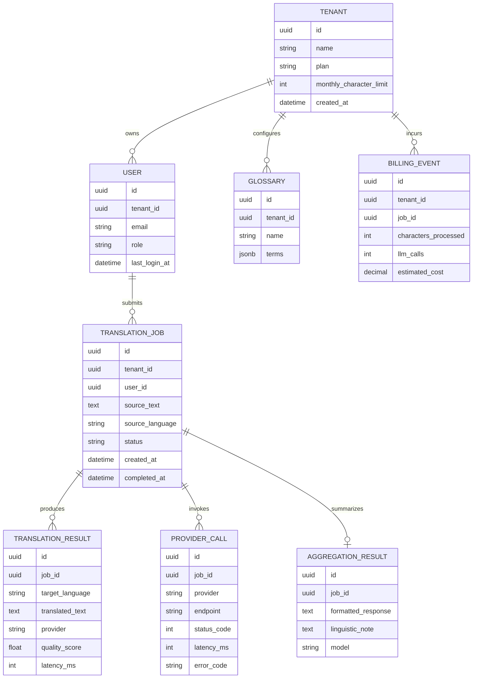

## 1. EXECUTIVE SUMMARY

**Project Name & Core Concept**  
**Parallel Agent Translation Pipeline**: a Google ADK-based TypeScript agent system that accepts English user input, translates it into French, Japanese, and Spanish in parallel, then aggregates the outputs into a concise multilingual response with a linguistic comparison note.

**Analyzed Source Material**  
Files reviewed outside `node_modules`: [agent.ts](/Volumes/MAC_DOCS/repos/GDG-02/gdg-warsaw/parallel-agent/agent.ts), [package.json](/Volumes/MAC_DOCS/repos/GDG-02/gdg-warsaw/parallel-agent/package.json), [tsconfig.json](/Volumes/MAC_DOCS/repos/GDG-02/gdg-warsaw/parallel-agent/tsconfig.json), [pnpm-workspace.yaml](/Volumes/MAC_DOCS/repos/GDG-02/gdg-warsaw/parallel-agent/pnpm-workspace.yaml), [pnpm-lock.yaml](/Volumes/MAC_DOCS/repos/GDG-02/gdg-warsaw/parallel-agent/pnpm-lock.yaml), and `.env` variable names only. No Python files are present.

**Target Audience & Market Fit**  
Primary fit is for language-learning tools, localization assistants, multilingual support teams, and agent-orchestration demos that need low-latency fan-out/fan-in workflows. The current implementation is a prototype rather than a production SaaS: it has no persisted users, billing, audit trail, frontend product UI, rate limiting, or translation memory.

**Assumptions**  
The system is intended to evolve from a local ADK demo into a deployable translation assistant. Revenue, if commercialized, would likely come from B2B subscriptions, API usage billing, or internal enterprise productivity licensing. The current source assumes English input only and three fixed target languages.

---

## 2. BUSINESS & FUNCTIONAL ARCHITECTURE

**Core Value Proposition**  
The project reduces translation latency by executing language-specific translators concurrently, then improves usability by presenting the translated outputs through a single aggregator agent. Its strategic value is less “translation alone” and more “parallel agent orchestration pattern for multilingual processing.”

**Functional Modules & Feature Matrix**

| Module | Current Implementation | Production Requirement | Priority |
|---|---|---|---|
| User Input Intake | ADK root agent receives free-text input | Web/API input endpoint with request validation, size limits, language detection, and abuse controls | MVP |
| Agent Orchestration | `SequentialAgent` runs `ParallelAgent`, then aggregator | Durable workflow tracing with request IDs, timeout handling, retries, and partial-result behavior | MVP |
| Translation Execution | Three `LlmAgent`s call `translate_text` with fixed `fr`, `ja`, `es` | Dynamic target-language selection, glossary support, translation quality scoring | MVP / Phase 2 |
| Translation Tool | `FunctionTool` calls MyMemory API via `fetch` | Provider abstraction for MyMemory, Google Cloud Translation, DeepL, or Gemini-native translation fallback | MVP |
| Aggregation | Gemini Flash agent formats outputs and adds one linguistic note | Deterministic output schema, confidence metadata, source/target language labels, optional JSON mode | MVP |
| LLM Provider | Gemini via `GEMINI_API_KEY` and `gemini-flash-latest` | Managed secret storage, model version pinning, cost/latency monitoring, fallback model | MVP |
| Developer Interface | `pnpm start`, `pnpm web` via ADK devtools | CI pipeline, typecheck, lint, tests, local sandbox fixtures | MVP |
| Persistence | None in authored code | PostgreSQL for users, jobs, translations, provider events; Redis for request cache | Phase 2 |
| Observability | `setLogger(null)` disables ADK logging | OpenTelemetry traces, structured logs, provider latency metrics, redacted payload logging | MVP |
| Security | `.env` contains `GEMINI_API_KEY`; no auth | OAuth2/OIDC login, JWT session with HttpOnly cookies, per-tenant rate limits, secret manager | Phase 2 |
| Billing | None | Stripe metered billing by characters translated and LLM aggregation calls | Scale |

**Key User Workflows**

1. **Single Translation Request**
   User enters English text → root sequential agent starts → French, Japanese, and Spanish agents run concurrently → each calls MyMemory API → aggregator receives `{french_translation}`, `{japanese_translation}`, `{spanish_translation}` → user receives formatted output plus one linguistic insight.

2. **Developer Demo Workflow**
   Developer installs dependencies → configures `GEMINI_API_KEY` → runs `pnpm start` for CLI execution or `pnpm web` for ADK web UI → submits sample text → observes parallel agent orchestration.

3. **Future Enterprise Workflow**
   Authenticated user selects target languages and domain glossary → submits text/document/API payload → system creates translation job → parallel provider workers execute translations → aggregator normalizes result → job is stored, audited, billed, and exposed via UI/API.

---

## 3. TECHNICAL ARCHITECTURE SPECIFICATION

**Current Stack**

| Layer | Current Technology | Notes |
|---|---|---|
| Runtime | Node.js / TypeScript ESM | `type: "module"`, Node16 module resolution |
| Agent Framework | `@google/adk` 1.1.0 | Uses `LlmAgent`, `ParallelAgent`, `SequentialAgent`, `FunctionTool` |
| Devtools | `@google/adk-devtools` 1.1.0 | Provides `adk run` and `adk web` workflows |
| Validation | Zod 4.4.3 | Used for function-tool parameter schema |
| LLM | Gemini Flash latest | Configured implicitly through `GEMINI_API_KEY` |
| Translation API | MyMemory public API | Called directly from tool using query-string URL |
| Build Config | Strict TypeScript, `noEmit` | TypeScript compiler is not installed as a direct dependency |

**Recommended Production Stack & Justification**

| Layer | Recommendation | Justification |
|---|---|---|
| Backend | Node.js 22 LTS, TypeScript, Fastify or NestJS | Fits existing TS code; supports structured APIs and production middleware |
| Agent Runtime | Google ADK with explicit model version pinning | Preserves current design while avoiding behavior drift from `latest` aliases |
| Frontend | Next.js or Angular admin console | Provides authenticated job dashboard, history, glossary management |
| Primary DB | PostgreSQL | Strong fit for tenants, users, jobs, translation records, billing events |
| Cache / Queue | Redis + BullMQ | Cache repeated translations; queue long jobs and retries |
| Secrets | Google Secret Manager or AWS Secrets Manager | Replace local `.env` in deployed environments |
| Observability | OpenTelemetry + Grafana/Cloud Trace | ADK dependencies already include telemetry-compatible packages |
| Auth | OAuth2/OIDC with Auth0, WorkOS, or Google Identity | Enterprise-ready identity, SSO, tenant isolation |
| Billing | Stripe Billing + metered usage | Character-count and request-count monetization |
| Deployment | Cloud Run or Kubernetes | Cloud Run is sufficient for MVP; Kubernetes only when workflow volume grows |

**Conceptual Entity-Relationship Diagram**

**Integration Points & External Dependencies**

| Integration | Current / Proposed | Purpose | Control Needed |
|---|---|---|---|
| Gemini API | Current via ADK and `GEMINI_API_KEY` | Aggregation and agent reasoning | Model pinning, retries, cost telemetry, prompt versioning |
| MyMemory API | Current direct HTTPS call | Machine translation | Timeout, retry, quota handling, response validation, provider fallback |
| ADK Web/CLI | Current dev interface | Local execution and inspection | Development only; not sufficient as customer-facing product |
| PostgreSQL | Proposed | Persistent jobs, users, results, billing | Migrations, backups, row-level tenant constraints |
| Redis | Proposed | Cache and background jobs | TTL policies, dead-letter queues |
| Stripe | Proposed | Subscriptions and usage-based billing | Idempotent webhook handling |
| OAuth2/OIDC Provider | Proposed | Authentication | HttpOnly session cookies, CSRF protection, tenant roles |

---

## 4. IMPLEMENTATION ROADMAP & RISK MATRIX

**Milestone Breakdown**

| Phase | Scope | Deliverables |
|---|---|---|
| MVP Stabilization | Make current ADK pipeline reliable | Add direct `typescript` dev dependency, typecheck script, translation tool timeout, MyMemory response Zod schema, structured aggregator output, provider error handling |
| MVP Product API | Expose translation pipeline as a service | REST endpoint `POST /translation-jobs`, request validation, configurable target languages, job response schema, OpenAPI docs |
| Phase 2 Persistence | Add product memory and auditability | PostgreSQL schema, job history, provider-call logs, translation cache, user/tenant model |
| Phase 2 Security | Prepare for real users | OAuth2/OIDC, JWT session via HttpOnly Secure SameSite cookies, RBAC roles, per-tenant rate limits |
| Phase 2 UI | Operational web app | Translation workspace, job history, language selector, glossary manager, admin usage dashboard |
| Scale Phase | Commercial readiness | Stripe metered billing, provider failover, observability dashboards, SLOs, queue workers, multi-region deployment if needed |

**Risk / Mitigation Matrix**

| Risk Description | Impact Level | Mitigation Strategy |
|---|---:|---|
| `gemini-flash-latest` may change behavior over time | High | Pin a concrete Gemini model version and store prompt/model version on each job |
| MyMemory public API may rate-limit, degrade, or return inconsistent payloads | High | Add provider abstraction, response validation, 3-second timeout, exponential backoff, fallback to Google Cloud Translation or DeepL |
| No authentication or tenant isolation | High | Add OAuth2/OIDC, tenant-scoped database rows, RBAC, and HttpOnly cookie sessions before external release |
| No persistence means no audit trail, history, billing, or recovery | High | Introduce PostgreSQL entities for jobs, results, provider calls, and billing events |
| Current logging is disabled with `setLogger(null)` | Medium | Enable structured logs with request IDs and redact source text by default; export metrics via OpenTelemetry |
| TypeScript compiler is not installed directly | Medium | Add `typescript` as a dev dependency and `pnpm typecheck` script |
| Prompt injection could alter translator/aggregator behavior | Medium | Treat user input strictly as data, use tool parameters rather than prompt interpolation where possible, require JSON output schema for aggregator |
| Fixed English source language limits market fit | Medium | Add language detection and explicit source-language selection |
| No cost controls for LLM/API usage | Medium | Track characters, provider calls, LLM tokens, per-tenant quotas, and hard usage ceilings |
| Parallel execution can create partial failures | Medium | Return per-language status, retry failed branches independently, allow degraded responses with clear unavailable-language markers |

**Validation Note**  
I attempted `pnpm exec tsc --noEmit`; it failed because `tsc` is not installed in the project. That is an implementation gap, not a source parsing failure.