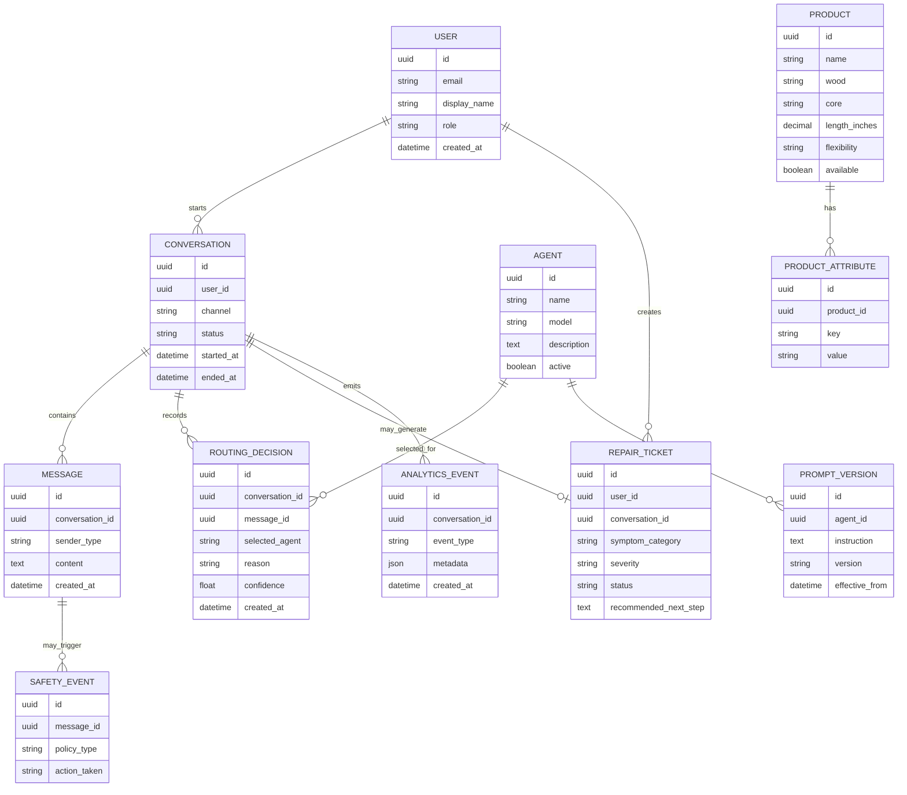

## 1. EXECUTIVE SUMMARY

**Project Name & Core Concept:** `routing-agent` is a TypeScript-based Google ADK multi-agent routing prototype. It implements an Ollivanders-themed customer-support assistant where a root coordinator routes user requests to specialized LLM agents.

**Implemented Core Behavior:** The system has three agents in [agent.ts](/Volumes/MAC_DOCS/repos/GDG-02/gdg-warsaw/routing-agent/agent.ts:1):

- `OllivandersCoordinator`: front-of-shop routing agent.
- `WandSpecialist`: answers product-selection questions about wand woods, cores, lengths, flexibility, and purchasing guidance.
- `MagicalTechnician`: diagnoses malfunctioning wands and recommends repair next steps.

**Target Audience & Market Fit:** In its current form, this is best understood as a demonstration or MVP scaffold for domain-specific AI customer service routing. In production terms, the pattern fits ecommerce support, product advisory, repair triage, internal help desks, and specialized knowledge-routing assistants.

**Key Assumptions:**

- The “Ollivanders” domain is a fictional demonstration layer, not the final regulated business domain.
- Revenue, payments, account management, persistent storage, analytics, and human handoff are not implemented in the current repository.
- Runtime authentication for Gemini/Google GenAI is expected to be supplied externally through the ADK environment, likely via Google credentials or API key configuration.
- `zod` is declared but not currently used.
- No Python files or additional project specs were present in the repository.
- `node_modules` was excluded from source analysis as requested.

---

## 2. BUSINESS & FUNCTIONAL ARCHITECTURE

### Core Value Proposition

The project solves the problem of routing customer queries to the correct specialist agent without hardcoded conditional logic. Instead of using static `if/switch` intent detection, the root LLM agent interprets sub-agent descriptions and delegates via `transfer_to_agent`.

For a production business, this reduces support friction by:

- Separating sales advisory from repair/diagnostic support.
- Keeping domain prompts focused and easier to govern.
- Enabling future specialist expansion without rewriting a central rules engine.
- Improving answer quality by giving each agent a narrower operating scope.

### Functional Modules & Feature Matrix

| Module | Current Implementation | Business Purpose | Production Requirement |
|---|---:|---|---|
| Agent Orchestration | Implemented | Route user intent to the correct expert agent | Add routing telemetry, fallback handling, routing confidence checks |
| Product Advisory | Implemented via `WandSpecialist` | Help users choose among wand products | Replace hardcoded catalogue with database-backed product knowledge |
| Repair Triage | Implemented via `MagicalTechnician` | Diagnose malfunctioning wand issues | Add repair-ticket creation, severity classification, human escalation |
| Off-topic Handling | Implemented | Keep assistant scoped to wand questions | Add abuse filtering, policy guardrails, escalation rules |
| Catalogue Knowledge | Hardcoded in prompt | Provide basic product reference data | Move to product database or retrieval system |
| Authentication | Not implemented | Identify users and protect APIs | OAuth2/OIDC login with JWT access tokens and HttpOnly refresh cookies |
| Conversation Persistence | Not implemented | Maintain support history | Store sessions, messages, route decisions, and outcomes |
| Analytics | Not implemented | Measure routing quality and business impact | Capture intent, selected agent, resolution status, latency, cost |
| Admin Configuration | Not implemented | Manage agents, prompts, catalogue, policies | Build admin UI with versioned prompt/product configuration |
| Observability | Partially available through ADK dependencies, disabled logger | Debug and operate production system | Enable structured logs, OpenTelemetry traces, metrics, alerting |
| Validation | Dependency declared but unused | Validate API payloads and tool inputs | Use `zod` schemas for request, response, ticket, and catalogue validation |

### Key User Workflows

**Workflow 1: Wand Product Selection**

1. User asks about wand woods, cores, lengths, or purchase fit.
2. `OllivandersCoordinator` classifies the message as product-related.
3. Coordinator calls `transfer_to_agent` with `agent_name="WandSpecialist"`.
4. `WandSpecialist` answers using its role instruction and embedded catalogue.
5. User receives concise in-character product guidance.

**Workflow 2: Malfunction Diagnosis**

1. User reports wrong spells, physical damage, contamination, unresponsive core, or backfiring.
2. `OllivandersCoordinator` classifies the message as repair-related.
3. Coordinator calls `transfer_to_agent` with `agent_name="MagicalTechnician"`.
4. `MagicalTechnician` asks one clarifying question if symptoms are vague.
5. Technician provides short diagnosis and recommended next step.

**Workflow 3: Off-topic Request**

1. User asks for something unrelated to wands.
2. Coordinator does not transfer.
3. Coordinator responds with one short redirect asking the user to rephrase as a wand question.

---

## 3. TECHNICAL ARCHITECTURE SPECIFICATION

### Current Technology Stack

| Layer | Current Choice | Evidence |
|---|---|---|
| Runtime | Node.js / TypeScript ESM | `type: "module"` in [package.json](/Volumes/MAC_DOCS/repos/GDG-02/gdg-warsaw/routing-agent/package.json:1) |
| Agent Framework | `@google/adk` `1.1.0` | Declared in `package.json`; locked in `pnpm-lock.yaml` |
| Dev UI / Tooling | `@google/adk-devtools` `1.1.0` | `web` script runs `pnpm exec adk web agent.ts` |
| LLM Model | `gemini-flash-latest` | Used by all three `LlmAgent` instances |
| Validation | `zod` `4.4.3` | Declared dependency, not used |
| Package Manager | pnpm | `pnpm-lock.yaml`, `pnpm-workspace.yaml` |
| TypeScript Mode | Strict, ES2022, no emit | [tsconfig.json](/Volumes/MAC_DOCS/repos/GDG-02/gdg-warsaw/routing-agent/tsconfig.json:1) |

### Recommended Production Stack & Justification

| Layer | Recommendation | Justification |
|---|---|---|
| Backend API | Node.js 22 LTS, TypeScript, Fastify or NestJS | Strong typing, production API structure, easy schema validation |
| Agent Runtime | Google ADK with explicit agent registry | Preserves existing architecture while enabling controlled expansion |
| LLM Provider | Gemini via Google GenAI / Vertex AI | Current implementation already targets Gemini models |
| Database | PostgreSQL | Durable storage for users, sessions, product catalogue, tickets, audit logs |
| Cache / Rate Limiting | Redis | Session cache, routing memoization, abuse/rate controls |
| Search / Retrieval | pgvector or Vertex AI Search | Replace hardcoded catalogue with governed knowledge retrieval |
| Frontend | React/Next.js or Angular | Admin console, chat UI, ticket review, analytics dashboards |
| Auth | OAuth2/OIDC with HttpOnly cookies | Enterprise-compatible identity and session security |
| Observability | OpenTelemetry + Cloud Trace/Logging or Grafana stack | ADK dependency graph already includes OpenTelemetry packages |
| Deployment | Google Cloud Run or GKE | Natural fit for Google ADK/Gemini workloads |
| Secrets | Google Secret Manager | API keys, OAuth secrets, webhook credentials |
| CI/CD | GitHub Actions with pnpm install, typecheck, tests, lint | Current repo lacks verification scripts |

### Conceptual Entity-Relationship Diagram

### Integration Points & External Dependencies

| Integration | Current Status | Production Role |
|---|---:|---|
| Google ADK | Implemented | Agent orchestration and runtime |
| Gemini / Google GenAI | Implied by model names and ADK | LLM inference |
| ADK Devtools | Implemented via `web` script | Local testing and debugging |
| A2A SDK | Transitive dependency | Potential agent-to-agent protocol support |
| OpenTelemetry | Transitive dependency | Tracing, metrics, logs |
| SQLite / MikroORM / SQL drivers | Transitive dependencies | ADK/runtime persistence options, not used directly |
| Product Database | Not implemented | Source of truth for wand catalogue |
| Ticketing / CRM | Not implemented | Escalation to human support |
| Payment Gateway | Not implemented | Only needed if product purchase flow is added |
| Auth Provider | Not implemented | Enterprise identity and access control |

### Technical Gaps

| Gap | Consequence | Recommended Fix |
|---|---|---|
| `typescript` is not declared | `pnpm exec tsc --noEmit` fails with `Command "tsc" not found` | Add `typescript` as a dev dependency and define `typecheck` script |
| No tests | Routing regressions can go unnoticed | Add intent-routing tests and agent behavior contract tests |
| Hardcoded catalogue | Product updates require code changes | Move catalogue to PostgreSQL or retrieval index |
| Logger disabled with `setLogger(null)` | Production debugging is limited | Use structured ADK/OpenTelemetry logging |
| No environment documentation | Runtime credentials are implicit | Add `.env.example` and deployment docs |
| No schema validation in code | API/tool payloads would be fragile once exposed | Use `zod` schemas for input contracts |
| No security layer | Not suitable for public deployment | Add OAuth2/OIDC, rate limiting, audit logs, and prompt-injection controls |

---

## 4. IMPLEMENTATION ROADMAP & RISK MATRIX

### Milestone Breakdown

| Phase | Scope | Deliverables |
|---|---|---|
| MVP Hardening | Stabilize current prototype | Add `typescript`, `typecheck`, linting, README, `.env.example`, basic routing tests |
| MVP Productization | Make it usable as a support assistant | Add chat API, web chat UI, persistent conversations, structured routing logs |
| Phase 2: Knowledge & Operations | Replace prompt-embedded data | Product catalogue DB, retrieval layer, admin prompt editor, prompt versioning |
| Phase 3: Support Workflow | Close the business loop | Repair tickets, CRM integration, human handoff, resolution tracking |
| Phase 4: Analytics & Governance | Enterprise readiness | Routing dashboards, cost tracking, model evaluation, safety policies, audit trails |
| Scale Phase | Production deployment | Cloud Run/GKE deployment, autoscaling, Redis rate limiting, OpenTelemetry alerts, CI/CD gates |

### Risk/Mitigation Table

| Risk Description | Impact Level | Mitigation Strategy |
|---|---:|---|
| LLM routes to wrong specialist | High | Add deterministic evaluation set, route-decision logging, confidence scoring, fallback clarification prompt |
| Specialist answers outside scope | Medium | Strengthen agent instructions, add policy tests, enforce response validators where possible |
| Prompt-injection attempts alter routing behavior | High | Separate system instructions from retrieved content, add input filtering, log safety events, block tool misuse |
| Hardcoded catalogue becomes stale | Medium | Move product data to PostgreSQL and expose read-only retrieval tools to the product agent |
| No persistent conversation history | Medium | Store conversations/messages with retention policies and user consent controls |
| Runtime credentials undocumented | High | Add `.env.example`, Secret Manager deployment config, startup validation for required credentials |
| No automated typecheck or tests | High | Add `typescript`, `vitest`, `pnpm typecheck`, `pnpm test`, and CI enforcement |
| Logging disabled | Medium | Replace `setLogger(null)` with environment-controlled structured logging |
| Cost spikes from unrestricted LLM usage | Medium | Add rate limiting, per-user quotas, model cost telemetry, and max-turn limits |
| Vendor lock-in to Google ADK/Gemini | Medium | Abstract agent definitions and LLM invocation behind an internal interface if multi-provider support is required |
| Legal/IP risk from Ollivanders/Harry Potter theme | High | Treat current theme as demo-only; replace with owned domain terminology before commercial release |
| Public deployment without authentication | High | Require OAuth2/OIDC, HttpOnly cookies, CSRF protection for browser flows, and API authorization middleware |

### Verification Notes

I processed the repository files excluding `node_modules`: `package.json`, `pnpm-workspace.yaml`, `tsconfig.json`, `agent.ts`, and `pnpm-lock.yaml`.

I attempted TypeScript verification with `pnpm exec tsc --noEmit`. Dependency installation succeeded after approved network access, but verification could not run because `typescript` is not declared in the project, so `tsc` is unavailable.