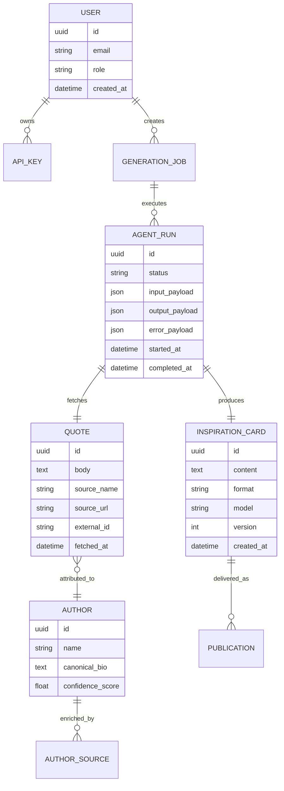

### 1. EXECUTIVE SUMMARY

**Project Name & Core Concept:** `QuoteNerdPipeline`, implemented in [agent.ts](/Volumes/MAC_DOCS/repos/GDG-02/gdg-warsaw/sequential-agent/agent.ts:88), is a sequential Google ADK multi-agent workflow that fetches a random inspirational quote, researches the quote author on Wikipedia, and synthesizes both into a one-line “Daily Inspiration” card.

**Target Audience & Market Fit:** The current implementation fits lightweight content automation use cases: daily inspiration apps, newsletter snippets, social media content feeds, internal engagement bots, learning demos for Google ADK sequential orchestration, and prototype agent pipelines.

**Current State:** This is a minimal TypeScript prototype, not yet a production product. The repository contains one source file plus pnpm/TypeScript configuration. No Python files were found. The runtime depends on Google ADK, ADK DevTools, Zod, Gemini model access, ZenQuotes, and Wikipedia APIs.

**Assumptions:**
- The project is intended to evolve from an ADK demo into a reusable content-generation service.
- `GEMINI_API_KEY` from `.env` is required for Gemini-backed ADK execution.
- There is no current persistence, authentication, billing, frontend, observability, retry policy, or content moderation layer.
- Monetization, if productized, would likely be SaaS subscription, API usage pricing, or internal enablement value rather than direct ad revenue.

### 2. BUSINESS & FUNCTIONAL ARCHITECTURE

**Core Value Proposition:**  
The system automates the creation of compact, context-aware inspirational content by combining external quote retrieval, author enrichment, and LLM-based copywriting. It reduces manual research and editorial effort while producing consistent short-form content suitable for daily publishing.

| Module | Current Implementation | Target Production Capability | Priority |
|---|---|---|---|
| Quote ingestion | `get_random_quote` calls `https://zenquotes.io/api/random` in [agent.ts](/Volumes/MAC_DOCS/repos/GDG-02/gdg-warsaw/sequential-agent/agent.ts:13) | Source abstraction, rate-limit handling, duplicate detection, source attribution | MVP |
| Author research | `search_wikipedia` searches Wikipedia and fetches page summary in [agent.ts](/Volumes/MAC_DOCS/repos/GDG-02/gdg-warsaw/sequential-agent/agent.ts:24) | Multi-source enrichment, disambiguation, confidence scoring | MVP |
| Sequential orchestration | `SequentialAgent` runs three sub-agents in fixed order | Workflow versioning, retries, tracing, fallback paths | MVP |
| LLM generation | Three `LlmAgent`s use `gemini-3-flash-preview` | Configurable model routing, prompt registry, output validation | MVP |
| Output formatting | Final card is one line ending with author attribution | Multiple formats: social post, email block, push notification, API JSON | Phase 2 |
| User/API access | None | REST API, scheduled jobs, webhook delivery, admin UI | Phase 2 |
| Persistence | None | Store quotes, authors, runs, generated cards, audit metadata | Phase 2 |
| Security | `.env` contains Gemini key; no app auth | OAuth2/OIDC login, HttpOnly session cookies, API keys for programmatic access | Phase 2 |
| Observability | `setLogger(null)` disables logging in [agent.ts](/Volumes/MAC_DOCS/repos/GDG-02/gdg-warsaw/sequential-agent/agent.ts:9) | OpenTelemetry traces, structured logs, run-level metrics, alerting | MVP hardening |
| Compliance/content safety | None | Source attribution, blocked terms, hallucination checks, moderation review | Scale |

**Key User Workflows:**
1. Content consumer opens a daily card feed and receives a generated quote card with author context.
2. Content operator schedules daily generation for one or more channels.
3. System fetches quote, identifies author, enriches biography, generates final card, validates output, stores result, and publishes or exposes it by API.
4. Admin reviews failed runs, regenerated outputs, source quality, and API usage.

### 3. TECHNICAL ARCHITECTURE SPECIFICATION

**Recommended Tech Stack & Justification:**

| Layer | Recommendation | Justification |
|---|---|---|
| Agent runtime | Google ADK with TypeScript | Already used through `@google/adk` in [package.json](/Volumes/MAC_DOCS/repos/GDG-02/gdg-warsaw/sequential-agent/package.json:10) |
| Language/runtime | Node.js 20+ with TypeScript ES2022 | Lockfile dependencies include packages requiring modern Node; config targets ES2022 in [tsconfig.json](/Volumes/MAC_DOCS/repos/GDG-02/gdg-warsaw/sequential-agent/tsconfig.json:3) |
| API backend | Fastify or NestJS | Typed REST API, validation, auth middleware, production lifecycle hooks |
| Validation | Zod | Already used for tool parameters in [agent.ts](/Volumes/MAC_DOCS/repos/GDG-02/gdg-warsaw/sequential-agent/agent.ts:7) |
| Database | PostgreSQL | Durable storage for users, cards, runs, source data, audit events |
| Cache/queue | Redis + BullMQ | Scheduled generation, retries, rate-limit buffers, async workflow execution |
| Frontend | Next.js or Angular | Operator dashboard, card preview, publishing controls |
| Auth | OIDC/OAuth2 with HttpOnly secure cookies; API keys hashed with SHA-256 | Human and machine access separation |
| Secrets | Cloud Secret Manager or Doppler | Avoid plaintext `.env` beyond local development |
| Observability | OpenTelemetry + structured JSON logs + Sentry | ADK workflow visibility and external API failure diagnosis |
| Deployment | Docker on Cloud Run/Fly.io/Render initially; Kubernetes later if needed | Small service footprint, simple scaling path |

**Conceptual Entity-Relationship Diagram:**

**Integration Points & External Dependencies:**
- **Google Gemini via Google ADK:** All three sub-agents currently use `gemini-3-flash-preview` in [agent.ts](/Volumes/MAC_DOCS/repos/GDG-02/gdg-warsaw/sequential-agent/agent.ts:49). Production should move model names to environment configuration and pin stable model versions where possible.
- **ZenQuotes API:** Used for random quote retrieval at [agent.ts](/Volumes/MAC_DOCS/repos/GDG-02/gdg-warsaw/sequential-agent/agent.ts:18). Add timeout, retry, attribution, schema validation, and fallback provider.
- **Wikipedia Search API:** Used for author lookup at [agent.ts](/Volumes/MAC_DOCS/repos/GDG-02/gdg-warsaw/sequential-agent/agent.ts:31).
- **Wikipedia REST Summary API:** Used for author biography extraction at [agent.ts](/Volumes/MAC_DOCS/repos/GDG-02/gdg-warsaw/sequential-agent/agent.ts:37).
- **Local DevTools:** `pnpm exec adk web agent.ts` exists for web inspection in [package.json](/Volumes/MAC_DOCS/repos/GDG-02/gdg-warsaw/sequential-agent/package.json:7).
- **Build policy:** `pnpm-workspace.yaml` allows native/package builds for Google GenAI, esbuild, protobufjs, and sqlite3 in [pnpm-workspace.yaml](/Volumes/MAC_DOCS/repos/GDG-02/gdg-warsaw/sequential-agent/pnpm-workspace.yaml:1).

### 4. IMPLEMENTATION ROADMAP & RISK MATRIX

**Milestone Breakdown:**

| Phase | Scope | Deliverables |
|---|---|---|
| MVP Hardening | Stabilize current agent | Add fetch timeout, response schema validation, error handling, retry policy, configurable model/source settings, structured logging |
| MVP Product API | Make pipeline callable | `POST /cards/generate`, `GET /runs/:id`, persisted run/card records, API key auth, rate limits |
| Phase 2 Dashboard | Human operations | Web UI for generated cards, run history, manual regeneration, source review, scheduled generation |
| Phase 2 Publishing | Distribution | Webhooks, email/newsletter export, social-ready templates, multi-format output |
| Scale | Reliability and governance | Queue-based execution, multi-provider quote fallback, OpenTelemetry tracing, moderation, cost controls, tenant isolation |

| Risk Description | Impact Level | Mitigation Strategy |
|---|---:|---|
| External quote API downtime or rate limits | High | Add provider abstraction, cached quote pool, exponential backoff, circuit breaker |
| Wikipedia author ambiguity | Medium | Store candidate search results, confidence score, require exact author extraction validation |
| LLM output format drift | Medium | Enforce structured JSON intermediary output, validate final card with Zod, regenerate on failure |
| No production logging due to `setLogger(null)` | High | Replace with environment-controlled structured logger and ADK run trace IDs |
| Missing TypeScript compiler dependency | Medium | Add `typescript` as dev dependency and CI command `pnpm exec tsc --noEmit`; current verification failed because `tsc` is not installed |
| Secret leakage through local `.env` | High | Keep `.env` out of VCS, use secret manager in deployment, rotate Gemini keys if exposed |
| Model preview instability | Medium | Configure model through env, support stable fallback model, capture model version per run |
| Hallucinated or unsourced author claims | Medium | Restrict biography facts to Wikipedia extract, store source URL, add source attribution metadata |
| Cost growth from repeated LLM calls | Medium | Cache author bios, reuse quote-author pairs, set per-tenant quotas and daily budgets |
| Lack of user/product boundary | Medium | Define whether this is a demo, internal tool, API product, or SaaS before building frontend/billing |

Verification note: I scanned all non-`node_modules` files in the repository. `pnpm exec tsc --noEmit` could not run because the project does not currently include `typescript`/`tsc` as an installed dependency.