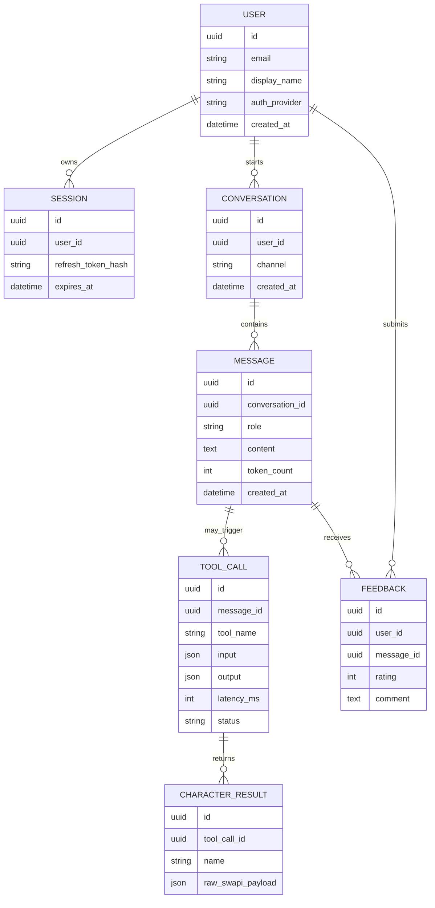

### 1. EXECUTIVE SUMMARY

**Project Name & Core Concept:**  
`single-agent` is a minimal TypeScript-based Google Agent Development Kit application that exposes one LLM agent, `star_wars_lookup`, for Star Wars character search. The agent uses Gemini through Google ADK and calls a custom `swapi_people` tool that fetches people data from SWAPI and filters character names locally. Source basis: [agent.ts](/Volumes/MAC_DOCS/repos/GDG-02/gdg-warsaw/single-agent/agent.ts:1), [package.json](/Volumes/MAC_DOCS/repos/GDG-02/gdg-warsaw/single-agent/package.json:1), [pnpm-workspace.yaml](/Volumes/MAC_DOCS/repos/GDG-02/gdg-warsaw/single-agent/pnpm-workspace.yaml:1).

**Target Audience & Market Fit:**  
The current implementation fits a developer demo, educational workshop, or proof of concept for tool-using AI agents. Its practical market value is not the Star Wars lookup itself, but the reusable pattern: natural-language request → validated function tool → external API retrieval → concise LLM summary.

**Source-Backed Observations:**  
The application uses `@google/adk`, `@google/adk-devtools`, and `zod`; runs through `pnpm exec adk run agent.ts` or `pnpm exec adk web agent.ts`; and depends on `GEMINI_API_KEY` in `.env`. The `.env` file contains a real-looking Gemini API key and should be treated as compromised: rotate it and remove it from source control.

**Assumptions:**  
No Python files or additional TypeScript modules were present outside `node_modules`. No production business requirements, authentication model, persistence layer, deployment target, SLAs, monetization model, or user-facing UI requirements were provided. The recommended architecture below assumes the goal is to evolve this proof of concept into a production-grade conversational lookup service.

---

### 2. BUSINESS & FUNCTIONAL ARCHITECTURE

**Core Value Proposition:**  
The system lets users ask for Star Wars characters by partial or full name and receive concise, natural-language results without knowing SWAPI endpoints or JSON structure. For builders, it demonstrates a compact, auditable agent architecture using typed tool parameters and an external data source.

| Module | Current State | Production Requirement | Priority |
|---|---|---|---|
| Agent Orchestration | `LlmAgent` named `star_wars_lookup` with Gemini model | Versioned agent config, prompt tests, fallback model policy | MVP |
| Tool Calling | One `FunctionTool`: `swapi_people` | Tool registry, typed outputs, timeout/retry policy, structured errors | MVP |
| Input Validation | `zod` validates `name: string` | Add min/max length, trimming, abuse filtering | MVP |
| Data Retrieval | Fetches `https://swapi.info/api/people` and filters locally | Cache SWAPI response, handle schema drift, retries, circuit breaker | MVP |
| Response Generation | Agent summarizes tool result concisely | Standard response contract: empty result, multiple matches, exact match | MVP |
| Runtime Interface | ADK CLI and ADK web scripts | Public web/API interface with session handling | Phase 2 |
| Authentication | Not implemented | OAuth2/OIDC login, JWT session via HttpOnly Secure SameSite cookies | Phase 2 |
| Persistence | Not implemented | Store conversations, tool calls, feedback, audit metadata | Phase 2 |
| Observability | Not implemented | OpenTelemetry traces, structured logs, token/tool-call metrics | MVP |
| Security | `.env` contains API key | Secret manager, key rotation, no committed secrets, rate limiting | MVP |
| Testing | Not implemented | Unit tests for tool filtering; integration tests for SWAPI/agent behavior | MVP |

**Key User Workflows:**  
1. Character lookup: user enters a character name or fragment; agent detects the name; calls `swapi_people`; filters SWAPI people by case-insensitive substring; returns concise matches.  
2. Missing input recovery: user asks vaguely; agent asks for a character name, as specified in its instruction.  
3. Developer operation: developer runs `pnpm start` for CLI execution or `pnpm run web` for ADK web development.

---

### 3. TECHNICAL ARCHITECTURE SPECIFICATION

**Current Stack:**  
Runtime: Node.js/TypeScript ESM. Package manager: `pnpm@9.1.0`. Agent framework: Google ADK TypeScript. Model: `gemini-3-flash-preview` as configured in source. Validation: Zod. External API: SWAPI people endpoint. Official references used: [Google ADK LLM agents](https://google.github.io/adk-docs/agents/llm-agents/), [Google ADK function tools](https://google.github.io/adk-docs/tools-custom/function-tools/), [ADK TypeScript API reference](https://adk.dev/api-reference/typescript/classes/LlmAgent.html), [SWAPI people endpoint](https://swapi.info/people).

**Recommended Production Stack & Justification:**  
Backend: TypeScript with Google ADK for agent orchestration, deployed behind a lightweight HTTP API using Fastify or Hono.  
Frontend: Next.js or React SPA only if a custom UX is needed; otherwise ADK web remains a developer console.  
Database: PostgreSQL for users, sessions, conversations, tool-call audit logs, feedback, and billing metadata.  
Cache: Redis for SWAPI response caching, rate limits, and short-lived session state.  
Secrets: Google Secret Manager or cloud-native equivalent; never `.env` in repository.  
Observability: OpenTelemetry traces, structured JSON logs, error aggregation, per-tool latency metrics.  
Security: OAuth2/OIDC authentication, JWT session cookies with `HttpOnly`, `Secure`, `SameSite=Lax/Strict`, CSRF protection for browser mutations, per-user/IP rate limits.  
Deployment: Containerized Node.js service on Cloud Run, GKE, or similar; CI checks for lint, tests, typecheck, secret scanning, and dependency audit.

**Conceptual Entity-Relationship Diagram:**

**Integration Points & External Dependencies:**  
Internal: ADK agent runtime, custom `swapi_people` function tool, Zod schema validation, CLI/web scripts.  
External: Gemini model API via `GEMINI_API_KEY`; SWAPI people API via HTTPS; optional future identity provider such as Google Identity Platform/Auth0/Okta; optional monitoring provider such as Cloud Monitoring, Datadog, or Sentry.  
Data pipeline: user prompt → ADK agent → Zod-validated tool args → SWAPI fetch → local substring filter → structured tool result → LLM summary → user response.

---

### 4. IMPLEMENTATION ROADMAP & RISK MATRIX

| Milestone | Scope | Exit Criteria |
|---|---|---|
| MVP Hardening | Rotate exposed key, add `.env.example`, validate input length, add fetch timeout/retry, cache SWAPI response, add tests | Tool works deterministically; no committed secrets; test suite passes |
| MVP Productization | Define response contract, add structured logging, add CI typecheck/test/audit, document run/deploy process | Reproducible local and CI execution |
| Phase 2 Web/API | Add HTTP API, optional React/Next.js UI, user sessions, conversation history | Authenticated users can run lookups and review history |
| Phase 2 Observability | Add traces for agent call, tool call, external API latency, token use | Operators can diagnose failures and cost drivers |
| Scaling | Redis cache, PostgreSQL audit store, rate limits, deployment autoscaling, model fallback | Stable under concurrent usage and external API degradation |
| Commercialization | Package as generic fandom/catalog lookup agent pattern | Supports configurable data providers beyond SWAPI |

| Risk Description | Impact Level | Mitigation Strategy |
|---|---:|---|
| Gemini API key is present in `.env` and may be exposed | High | Rotate immediately, remove from git history if committed, use secret manager, add secret scanning in CI |
| No timeout on SWAPI request | Medium | Use `AbortController` with 3-5s timeout and return a typed degraded response |
| Fetches all people on every query | Medium | Cache full SWAPI people payload in Redis or memory with TTL; invalidate periodically |
| Tool output type only models `{ name: string }` | Medium | Define full character schema with Zod or TypeScript interface and validate external response |
| No tests for lookup behavior | Medium | Add unit tests for matching, empty results, case-insensitivity, and SWAPI failure handling |
| Preview model configured directly in source | Medium | Move model name to environment config with approved defaults and fallback model policy |
| No authentication or rate limiting | High for public deployment | Add OIDC login, HttpOnly JWT cookies, per-IP and per-user token bucket limits |
| SWAPI availability/schema drift | Medium | Add response validation, cache last known good payload, monitor non-2xx/error rates |
| IP/commercial constraints around Star Wars data | Medium | Treat as demo unless licensing is clarified; for commercial use, swap to licensed/internal catalog data |
| No observability into tool calls or token usage | Medium | Emit structured logs and OpenTelemetry spans for agent invocation, tool input/output status, latency, and errors |
